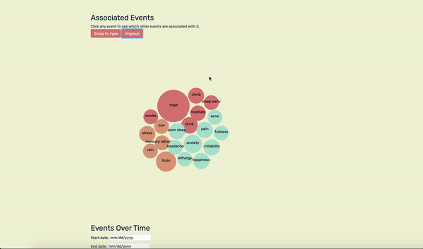
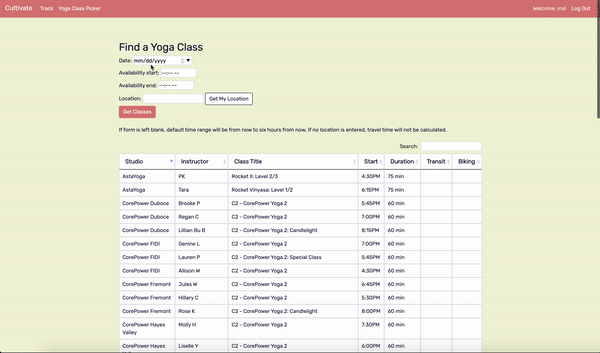

# Cultivate
Cultivate is a wellness tracker that enables users to create custom habits, influences, and symptoms, and track them, and analyze how they correlate with each other over time.

Users can link their Google Calendar credentials to their account, enabling the app to quickly scrape habits from events in their calendar (e.g., an event titled "Power Yoga" will be tracked if the user is tracking "yoga" as a habit). The app reaches out to the Google Calendar API and opens an OAuth window so that the user can log in. Once logged in, the app stores their credentials in the app database as a pickle, enabling the user to continue tracking their events without reauthenticating.

Users can also opt to share their location with each event tracked. If the location is included, the app will automatically add "temperature" and "weather" as influences to track, then reach out to the OpenWeatherMap API to grab the weather info at that location and track it. This way the user can easily see how weather and temperature correlate with various habits and symptoms over time.

Cultivate uses D3 and Chart.js to provide interactive charts that visualize the user's data and illustrate which events correlate. A D3 bubble force chart is shown below. Here, the app makes an AJAX request to generate nodes for all your tracked events, sizing them relative to their number of occurrences, then uses D3 force to cluster them all together. In the background, the app calculates which event types occurred within one day of each other and embeds that association data into each node object. When you click on a node, event listeners will update the embedded group ids, restart the D3 force energy, and use that energy to re-cluster the nodes. That way you can easily see which events are associated with each other and hopefully start to infer causation from there.

Bonus: Users can access a "Yoga Class Picker" that scrapes data from three different data sources, gathering info from 15 San Francisco yoga studios, to generate a list of classes the user can take based on their availability. If the user includes their starting location, the app will also reach out to the Google Maps API, calculate the travel time to each class, and eliminate classes the user won't reach on time. Travel times are included in the results, as well.

